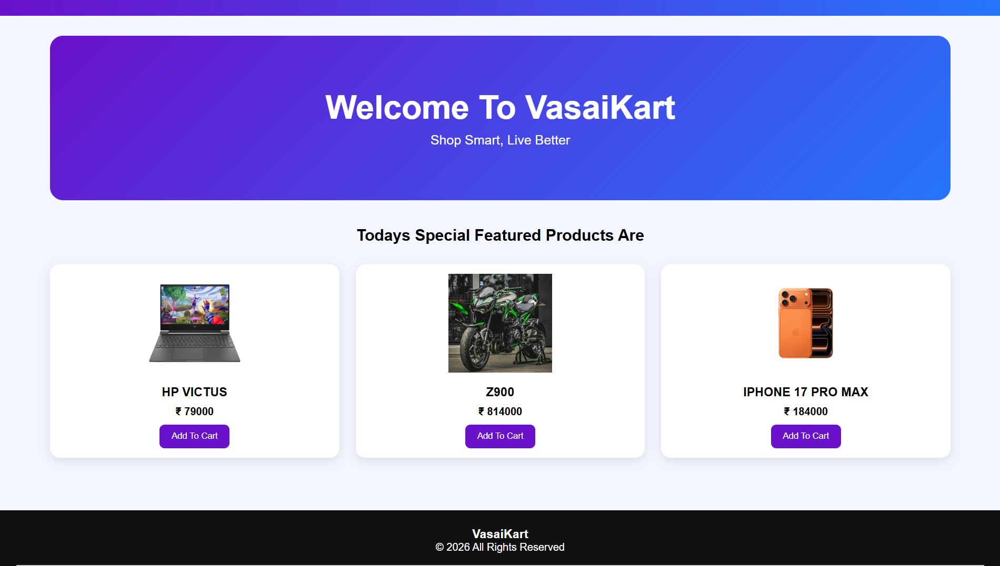
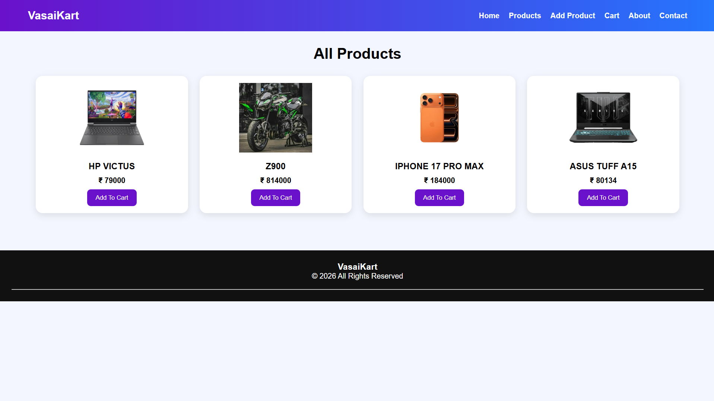
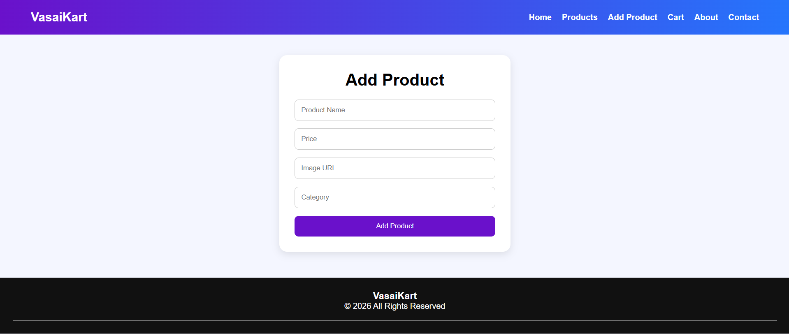
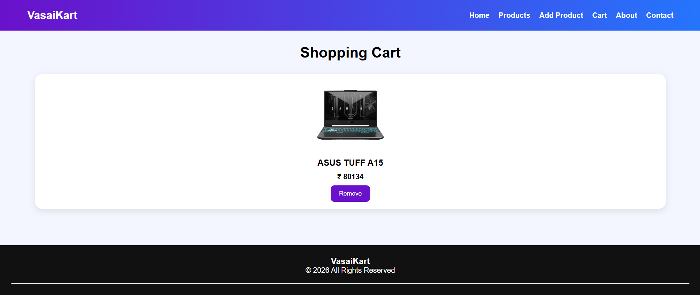
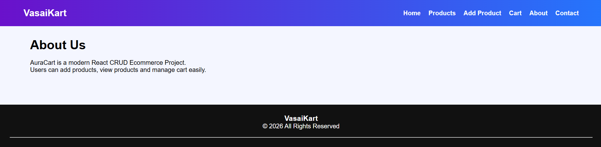
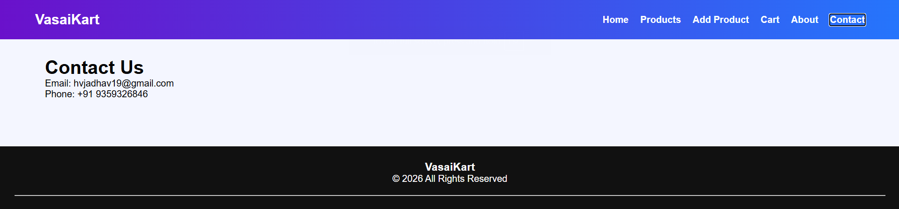

# VasaiKart

A React + Vite based CRUD E-Commerce website that allows users to browse products, add new products, manage their shopping cart, and explore product information through a modern and responsive user interface.

## Project Explanation

VasaiKart is a simple React CRUD application developed using React.js and Vite. The application demonstrates core React concepts such as components, routing, state management, and Context API.

The application contains:

* A navigation bar with links to Home, Products, Add Product, Cart, About, and Contact pages.
* A Home page featuring highlighted products.
* A Products page displaying all available products.
* An Add Product page to add new products dynamically.
* A Shopping Cart page to manage selected products.
* An About page describing the project.
* A Contact page containing contact information.

## Tech Stack

* React.js
* Vite
* JavaScript (ES6)
* HTML5
* CSS3
* React Router DOM
* Context API

## Folder Structure

```text
website/
│
├── src/
│   ├── pages/
│   │   ├── Home.jsx
│   │   ├── Products.jsx
│   │   ├── Cart.jsx
│   │   ├── Contact.jsx
│   │   └── About.jsx
│   │
│   ├── screenshots/
│   │   ├── Home.png
│   │   ├── Products.png
│   │   ├── AddProducts.png
│   │   ├── Cart.png
│   │   ├── AboutUs.png
│   │   ├── Contact.png
│   │   ├── hpvictus.png
│   │   ├── iphone17.png
│   │   └── z900.png
│   │
│   ├── App.jsx
│   ├── main.jsx
│   └── index.css
│
├── package.json
├── vite.config.js
└── README.md
```

## Pages

### Home Page

Route: `/`

The Home page displays featured products and a welcome banner.

#### Screenshot



---

### Products Page

Route: `/products`

Displays all available products with images, names, prices, and cart functionality.

#### Screenshot



---

### Add Product Page

Route: `/add-product`

Allows users to add new products dynamically.

#### Screenshot



---

### Cart Page

Route: `/cart`

Displays products added to the shopping cart and allows users to remove items.

#### Screenshot



---

### About Page

Route: `/about`

Provides information about the VasaiKart project.

#### Screenshot



---

### Contact Page

Route: `/contact`

Displays contact details and support information.

#### Screenshot



---

## Product Images

### HP Victus


### Kawasaki Z900


### iPhone 17 Pro Max


---

## Installation

### Clone the Repository

```bash
git clone <your-repository-url>
cd website
```

### Install Dependencies

```bash
npm install
```

### Run Development Server

```bash
npm run dev
```

After running the command, open:

```text
http://localhost:5173
```

## Available Scripts

```bash
npm run dev
```

Starts the development server.

```bash
npm run build
```

Creates a production build.

```bash
npm run preview
```

Previews the production build.

## Developed By

**Hardik Vinod Jadhav**

Diploma in Computer Engineering

## Project Type

React CRUD E-Commerce Website

## License

This project is developed for educational and learning purposes.
